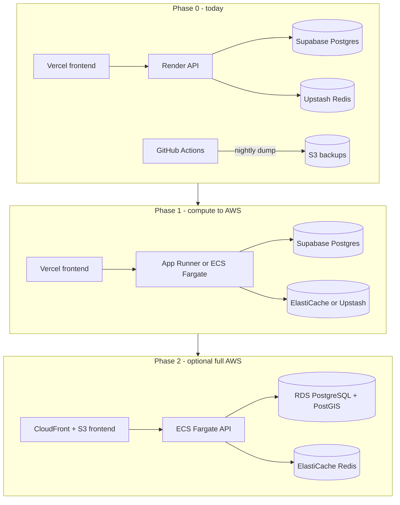

# SoloWay → AWS Migration Strategy

A phased, low-risk path from the launch stack (Vercel + Render + Supabase +
Upstash) to AWS. Written now so decisions made later are cheap; **none of this
is required to launch.**

## Why the app is easy to move (deliberate design wins)

- **Auth is ours, not Supabase's.** JWTs are issued and verified by the API
  (`backend/src/shared/middleware/auth.js`), not Supabase Auth. A database move
  never breaks sessions or forces password resets.
- **The backend is containerized.** `backend/Dockerfile` (Node 20 alpine,
  multi-stage) runs identically on Render, App Runner, ECS, or a VM.
- **Redis usage is ephemeral** (cache, refresh tokens, rate-limit counters).
  Repointing `REDIS_URL` is the whole migration; worst case users re-login.
- **Postgres is plain Postgres + PostGIS.** Migrations are versioned SQL in
  `backend/src/shared/database/migrations/`; nothing Supabase-proprietary in
  the schema.
- **Nightly S3 backups** ([BACKUPS.md](BACKUPS.md)) already put a restorable
  copy of the database inside AWS — the seed for any data move.

## The one honest caveat: the data-access layer

The backend talks to Postgres two ways:

| Style | Modules |
|-------|---------|
| Supabase JS client (`getSupabaseAdmin()` → PostgREST API) | auth, users, itineraries, safety, social, waitlist, reviews, providers, experiences + the auth middleware |
| Raw SQL via `pg` pool (`query`/`transaction`) | buddy, payments, webhooks, admin (and parts of the mixed modules) |

The Supabase JS client calls Supabase's hosted REST layer — it **cannot point
at RDS**. Migrating the database itself is a one-evening `pg_dump`/`pg_restore`
job, but first ~9 modules would need their Supabase-client calls rewritten as
SQL against the existing `pg` pool (the newer modules already model this
pattern; ~2–4 focused days plus regression testing).

**Recommendation:** treat Supabase as your managed-Postgres vendor even after
compute moves to AWS. That is a perfectly sound long-term posture. Only pay for
the data-layer refactor when a concrete driver appears (VPC-only compliance
requirement, Supabase pricing/limits, or the need for RDS-specific features).

## Phases



### Phase 0 (now): PaaS launch, zero lock-in accumulation

Nothing to do — the launch stack already avoids proprietary coupling. Signals
that it's time for Phase 1:

- PaaS bills crossing ~$100/month (the AWS equivalents become competitive)
- Need for private networking (VPC-only DB access, compliance)
- Sustained WebSocket connection counts that need horizontal scaling control

### Phase 1: lift-and-shift the API container

Move compute only; keep Supabase and Redis exactly as they are.

1. Push the existing image to ECR:

```bash
aws ecr create-repository --repository-name soloway-api
docker build -t soloway-api ./backend
docker tag soloway-api:latest <account>.dkr.ecr.<region>.amazonaws.com/soloway-api:latest
docker push <account>.dkr.ecr.<region>.amazonaws.com/soloway-api:latest
```

2. Run it on **App Runner** (simplest: managed TLS, autoscaling, health checks
   against `/health`) or **ECS Fargate + ALB** (more control; required if you
   want VPC-internal networking). Set the same env vars Render had — the app
   does not know or care which platform it is on. One nuance: WebSockets —
   App Runner supports them, but verify Socket.io reconnection behavior under
   its request timeout; ALB is the safer choice for heavy realtime use
   (enable sticky sessions; the Redis adapter already handles multi-instance
   fan-out).
3. Secrets move from Render's dashboard to **AWS Secrets Manager** /
   SSM Parameter Store, injected into the service definition.
4. Cut over DNS (see "Cutover mechanics"). Render can stay alive for a week as
   an instant rollback target — it's $7.

Optional in this phase: swap Upstash for **ElastiCache** (only meaningful once
the API is inside a VPC; Upstash-over-TLS works fine from AWS too).

### Phase 2 (optional): frontend and data layer

- **Frontend:** S3 + CloudFront (or AWS Amplify Hosting). Static SPA hosting is
  trivially portable — this can happen anytime or never; Vercel is fine
  indefinitely. Remember the SPA fallback (CloudFront 403/404 →
  `/index.html`) and the `VITE_API_URL` build env.
- **Data layer (the real project):**
  1. Refactor the 9 Supabase-client modules to SQL on the `pg` pool (the
     buddy/payments/admin modules are the in-repo pattern to copy). Ship this
     against Supabase first — it's independently valuable and de-risks the move.
  2. Stand up **RDS for PostgreSQL** (PostGIS supported; `db.t4g.micro` to
     start), restore the latest S3 backup into it, and validate with the
     restore runbook smoke checks.
  3. For minimal downtime, use **logical replication** from Supabase to RDS
     (both are vanilla Postgres) and cut over during a quiet window; at
     launch-scale, a brief maintenance window with a fresh dump/restore is
     simpler and just as safe.
  4. Repoint `DATABASE_URL` + `DATABASE_CA_CERT` (RDS CA bundle), redeploy,
     verify `/health`, keep Supabase read-only for a week before deleting.

### Azure equivalents (for reference)

If circumstances ever favor Azure: Container Apps ↔ App Runner/Fargate,
Azure Database for PostgreSQL Flexible Server ↔ RDS, Azure Cache for Redis ↔
ElastiCache, Static Web Apps ↔ S3+CloudFront, Blob Storage ↔ S3, Key Vault ↔
Secrets Manager. The same phases apply unchanged.

## Cutover mechanics (any phase)

1. **Days before:** lower the DNS TTL on the record being moved (e.g.
   `api.soloway.app`) to 300s.
2. **Blue/green:** run old and new stacks simultaneously; both point at the
   same database/Redis, so there is no data divergence risk for compute moves.
3. Smoke-test the new stack directly via its platform URL (health, login,
   one booking in Stripe test mode, one buddy invite).
4. Flip the DNS record. Watch Sentry + structured logs + `/health` on both
   stacks; traffic drains to the new one within minutes at a 300s TTL.
5. **Rollback = flip DNS back.** Keep the old stack warm for several days.
6. Database cutovers additionally need: maintenance banner, stop writes
   (scale API to zero), final dump/replication catch-up, restore/promote,
   repoint, verify, re-enable.

## Cost sketch (July 2026, us-east-1, launch-scale)

| Component | PaaS today | AWS Phase 1 | AWS Phase 2 |
|-----------|-----------|-------------|-------------|
| API compute | Render $7 | App Runner ~$5–15 (0.25 vCPU) | Fargate + ALB ~$25–40 |
| Postgres | Supabase Pro $25 | Supabase Pro $25 (kept) | RDS t4g.micro + storage ~$15–25 |
| Redis | Upstash $0 | Upstash $0 | ElastiCache t4g.micro ~$12 |
| Frontend | Vercel $0–20 | Vercel $0–20 | S3+CloudFront ~$1–5 |
| Backups | S3 <$1 | S3 <$1 | S3 + RDS snapshots ~$2 |

AWS is not cheaper at this scale — the migration's value is control (VPC,
IAM, instance sizing) and consolidation, not cost. That is why Phase 0 is
"do nothing until there's a driver."
